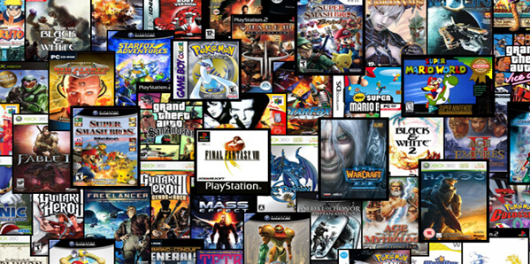

{fig-align="center" width="85%" style="border-radius: 8px; box-shadow: 0 4px 15px rgba(0,0,0,0.4); margin-bottom: 25px;"}

I decided to create a website focused on video game duration because players today face a real challenge: games are getting longer, bigger, and more time‑demanding, but most people have less free time than ever nowadays.

Many popular games take up to 40 or even 100+ hours to complete and players often don't understand what they are committing to before purchasing these amazing games. I would like to help players better understand how long it actually takes to complete these games.  

Across review platforms like Metacritic, both long and short games appear in the top‑rated lists. What matters most is quality, not length.